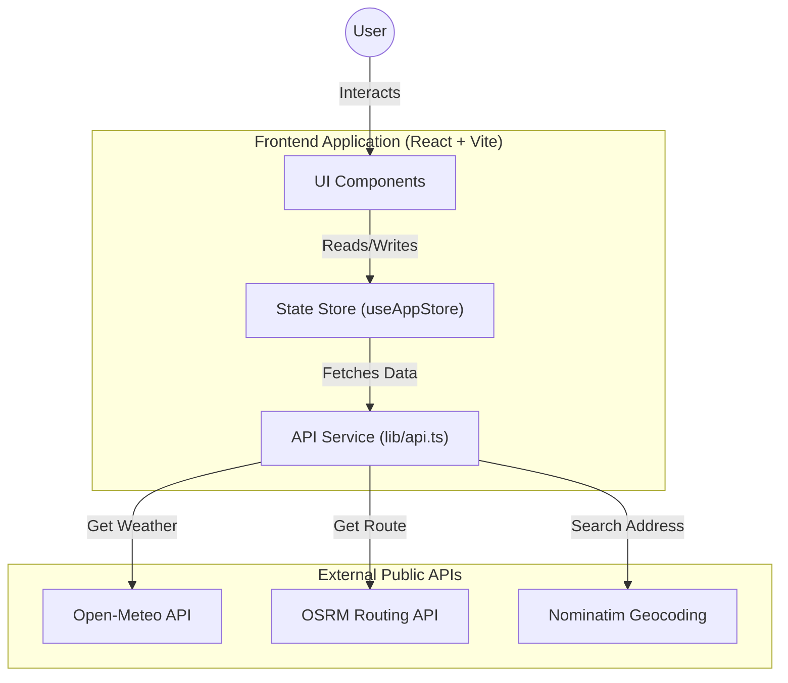

# CommuteOS 🌦️🚲

CommuteOS is a smart, real-time dashboard designed to optimize your daily commute and outfit choices. It aggregates live weather data and routing analytics to provide actionable recommendations.

## 🏗️ Architecture



CommuteOS is built on a modern, serverless frontend stack focusing on performance and privacy (no backend required).

### Core Stack
- **Framework**: [React](https://react.dev/) + [Vite](https://vitejs.dev/) (Fast HMR & Bundling)
- **Language**: [TypeScript](https://www.typescriptlang.org/) (Strict typing for robustness)
- **Styling**: [Tailwind CSS](https://tailwindcss.com/) (Utility-first, Glassmorphism design)
- **State Management**: React Hooks (`useAppStore`) + `localStorage` persistence.
- **Maps**: `react-leaflet` (OpenStreetMap integration).

### Data Layer (Real-Time APIs)
CommuteOS relies entirely on live public APIs. No API keys are required for the default setup.

1.  **Weather**: **[Open-Meteo API](https://open-meteo.com/)**
    -   Fetches current temp, rain status, and 7-day forecast.
    -   Auto-detects timezone.
2.  **Routing**: **[OSRM (Open Source Routing Machine)](http://project-osrm.org/)**
    -   Calculates driving and cycling routes.
    -   Returns precise distance, duration, and GeoJSON route geometry.
3.  **Geocoding**: **[OpenStreetMap Nominatim](https://nominatim.org/)**
    -   Converts addresses (e.g., "Empire State Building") to Lat/Lon coordinates.

### Key Components
-   `src/lib/api.ts`: Central service for all API calls (Weather, Route, Geocoding).
-   `src/hooks/useAppStore.ts`: Custom hook managing global state (Home/Work locations, Data cache).
-   `src/components/locationPicker.tsx`: Interactive map & search module for setting locations.
-   `src/components/*Modal.tsx`: Detailed views for Maps, Weather, and Outfits.

---

## 🚀 Features

-   **Smart Commute Cards**: Compares Uber vs. Bike travel times and costs.
-   **Dynamic Outfit Guide**: Suggests what to wear based on real-feel temp & rain status.
-   **Interactive Maps**: view your exact route path on a dark-mode city map.
-   **Search & Pin**: Easily set Home/Work locations by searching addresses or clicking the map.
-   **Offline-Ready Settings**: Your locations are saved locally in your browser.

## 🛠️ Setup & Running

1.  **Install Dependencies**
    ```bash
    npm install
    ```

2.  **Start Development Server**
    ```bash
    npm run dev
    ```

    npm run build
    ```

4.  **Deploy to GitHub Pages**
    
    We use **GitHub Actions** for auto-deployment.
    1.  Push to `main`: `git push origin main`
    2.  Go to Repo Settings -> Pages.
    3.  Set Source to **GitHub Actions**.
    
    *(The workflow in `.github/workflows/deploy.yml` handles the rest)*

## 📂 Project Structure

```
src/
├── components/       # UI Widgets (Cards, Modals, Picker)
├── hooks/            # Logic & State (useAppStore)
├── lib/              # API Clients & Utilities
├── App.tsx           # Main Dashboard Layout
└── main.tsx          # Entry Point
```

---

## 🧘 Vibecoding

Interested in how this was built? Check out our step-by-step [Vibecoding Tutorial](docs/VIBECODING_TUTORIAL.md) to see how we went from a napkin sketch to this production app using Google Antigravity.


---

*Built with ❤️ for the Modern Commuter.*
